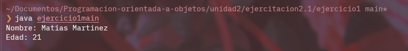

# **Ejercicio 1**

## Explicacion

Este ejercicio es bastante simple, consta de una clase persona en la que tenemos dos atributos, un nombre y una edad.

En el metodo main se llama a dos getters y se imprime en pantalla el nombre y edad de la persona.

## Imagen

