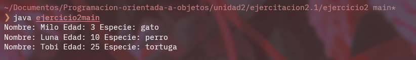

# **Ejercicio 2**

## Explicacion
En este encontramos una clase mascota que contiene tres atributos, edad, nombre y especie con sus respectivos getters

En el metodo main se crean tres mascotas nuevas y se imprimen los atributos correspondientes a cada uno.

## Imagen

