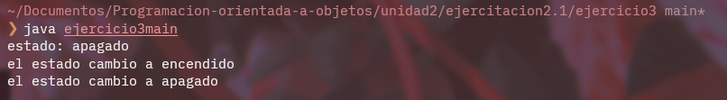

# **Ejercicio 3**

## Explicacion

En este ejercicio encontramos una clase auto la cual tiene tres metodos, uno para encender el auto, uno para apagarlo y uno que retorna el estado actual

En el metodo main se crea un objeto y se utilizan los tres metodos en el

## Imagen

