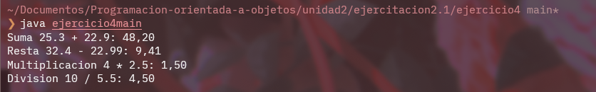

# **Ejercicio 4**

## Explicacion

En este ejercicio tenemos una clase llamada calculadora, la cual contiene 4 metodos basicos de una calculadora, suma, resta, multiplicacion y division. La division tambien contiene una verificacion en el caso que se decida dividir por 0.

En el main encontramos la creacion de un objeto calculadora sin parametrizacion y luego la utilizacion de sus metodos para realizar operaciones matematicas.

## Imagen

