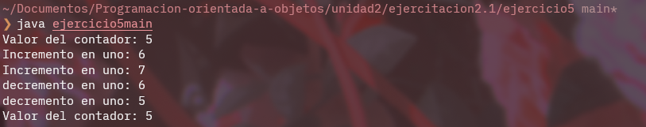

# **Ejercicio 5**

## Explicacion

Este ejercicio contiene una clase contador la cual tiene dos constructores, uno para inicializar en 0 y otro para inicializar con un valor. Tambien contiene tres metodos uno para incrementar, uno para decrementar y uno para retornar el valor del contador.

En el main se crea un contador con un valor de 5 y luego se incrementa y decrementa un par de veces.
## Imagen

